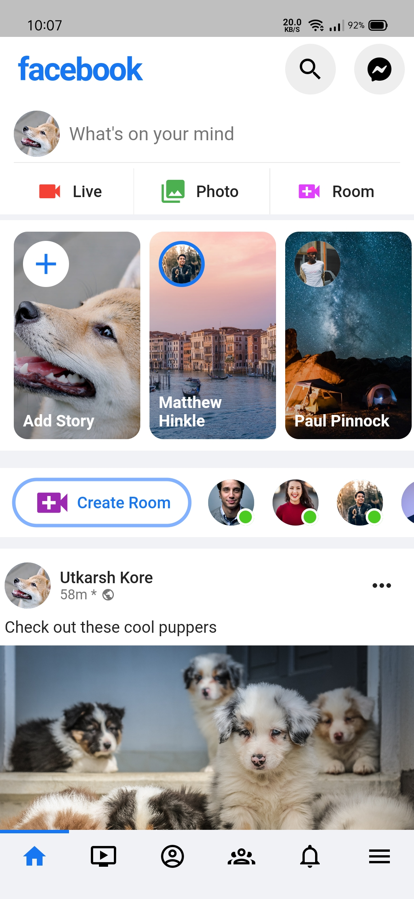

# Facebook Clone (UI)

## Introduction

The project is solely for practicing **Flutter Web.** It's a UI clone with dummy data without any backend

### Installation
To run this project, clone this repository and run [run flutter -d chrome] command.

### Some Glimpse

  
   

>Made with love by **Utkarsh** :heart:

>*This PWA is built with sole intention of exploring and showcasing UI skills :relaxed:*